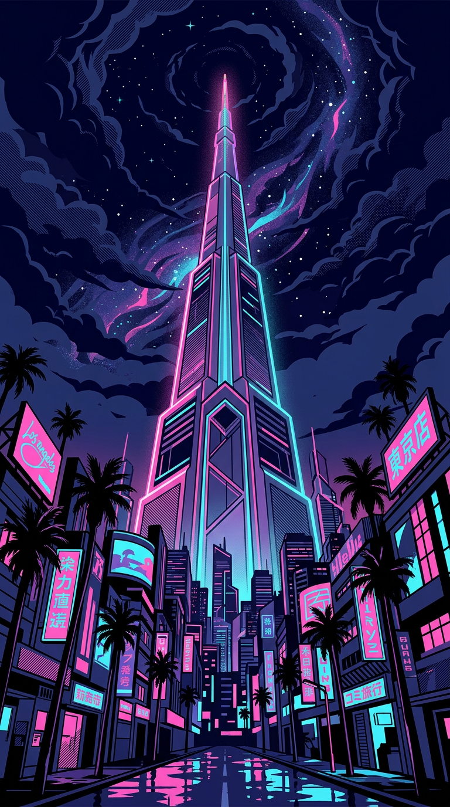

# SELFIE THE SPIRE

> Your face. Your hero. Your deck.

A neon-soaked roguelike deckbuilder where your selfie becomes your street legend. Snap a photo, let the 80's Magic do its thing, and battle your way up a procedurally generated tower with a custom hero and hand-painted cards.

**[Play Now](https://selfie-the-tower-production.up.railway.app)**



## What Is This

Take a selfie. The game reads your vibe, assigns you an archetype, and generates a unique character portrait and hero card — all with a minimalist risograph art style inspired by 80s screen prints.

Then you fight. Energy-based card combat, branching map paths, shops, mystery events, elite encounters, and rest sites. Standard Slay the Spire formula, neon-punk flavor.

## Features

- **Selfie-to-hero pipeline** — face capture, archetype assignment, portrait + card art generation
- **5 archetypes** — Neon (fire), Chrome (water), Volt (lightning), Concrete (earth), Smoke (shadow)
- **70+ cards** — 10 per archetype + 23 colorless utility cards
- **7 status effects** — Vulnerable, Weak, Strength, Dexterity, plus Burn (damage over time), Spikes (retaliation), and Regen (healing over time)
- **Combat loot** — pick 1 of 3 cards after every victory, or skip to keep the deck lean
- **23 enemies** — including elites and bosses with varied intents
- **Procedural maps** — seeded RNG for deterministic runs
- **Node events** — rest sites, shops, mystery encounters with narrative choices
- **Run persistence** — localStorage auto-save, resume where you left off
- **Combat juice** — screen shake, hit bursts, death dissolves, chip-damage HP bars
- **Mobile-first** — designed for phones, works on desktop

## Tech Stack

| Layer | Tech |
|-------|------|
| Frontend | React 18, TypeScript, Vite |
| State | Zustand |
| Backend | Hono (Node.js) |
| Image Gen | Google Gemini API |
| Image Processing | Sharp |
| Hosting | Railway |
| Fonts | Space Mono, Bebas Neue |

## Getting Started

### Prerequisites

- Node.js 18+
- A [Google Gemini API key](https://aistudio.google.com/apikey) (optional — falls back to mock generation without one)

### Setup

```bash
git clone https://github.com/mechaghost/selfie-the-tower.git
cd selfie-the-tower
npm install
```

Create the server env file:

```bash
cp server/.env.example server/.env
# Add your GEMINI_API_KEY to server/.env
```

### Development

```bash
npm run dev
```

This starts:
- **Vite dev server** on `http://localhost:5173` (hot reload)
- **Express API server** on `http://localhost:3001` (proxied via Vite)

> **Note:** The API server does not hot-reload. After changing server code in `server/src/`, restart it manually.

### Production Build

```bash
npm run build
npm start
```

## Environment Variables

| Variable | Required | Description |
|----------|----------|-------------|
| `GEMINI_API_KEY` | No | Google Gemini API key for character generation. Without it, the game uses mock data. |
| `PORT` | No | Server port (default: 3001, Railway sets automatically) |
| `ALLOWED_ORIGINS` | No | CORS origins (default: localhost) |
| `DAILY_GENERATION_CAP` | No | Max generations per day (default: 200) |

## Project Structure

```
src/
├── components/
│   ├── combat/        # Battle UI, hand, targeting
│   ├── map/           # Map, rest, shop, mystery screens
│   ├── ugc/           # Selfie capture & character reveal
│   └── ui/            # Shared UI components
├── core/              # Models, seeded RNG
├── data/              # Cards, enemies, encounters, events
└── store/             # Zustand game state

server/src/
├── routes/            # API endpoints
└── services/          # Gemini integration, image processing

public/assets/
├── cards/             # 70 card art images
├── enemies/           # 23 enemy portraits
├── characters/        # 5 archetype portraits
└── icons/             # 20 collectible 80s icons
```

## API

**POST `/api/generate-character`** — Submit a selfie, receive a generated character with portrait, archetype, deck, and hero card. Rate limited (3/min per IP, 200/day global).

**GET `/health`** — Health check.

## Deployment

Railway watches the `release` branch for auto-deployment.

```bash
git push origin main:release
```

## Art Style

Clean minimalist risograph print illustration. Flat color blocking in 2-3 solid ink layers, bold geometric shapes. Dark backgrounds with neon accents. No grain, no halftone — just sharp edges and high contrast.

## License

MIT
